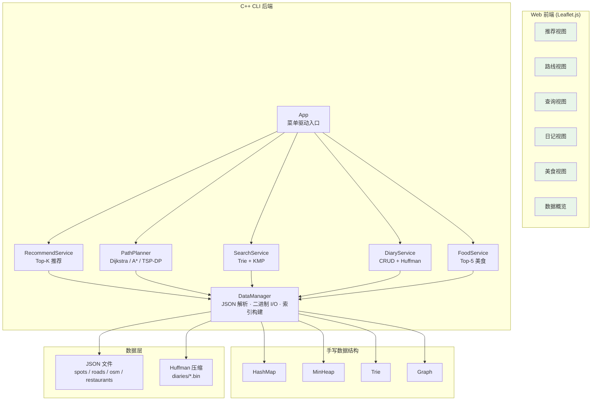

# 🗺️ 个性化旅游系统

<div align="center">

**Personalized Trip System · C++17 CLI + Web Visualization**

[](https://isocpp.org/)
[](https://www.mingw-w64.org/)
[](./LICENSE)
[](./cpp/scripts/build.ps1)
[](https://leafletjs.com/)

</div>

---

## 📖 项目概述

**个性化旅游系统** 是一个从零构建的大学课程设计项目。核心特点：

- 🧠 **手写算法**：Dijkstra、A\*、TSP 状态压缩 DP、KMP、Trie、Huffman 全部从零实现
- 🧱 **手写数据结构**：HashMap（链地址法）、MinHeap（二叉堆）、Trie（前缀树）、Graph（邻接表）
- 🪶 **零外部依赖**：不使用 STL 容器做核心逻辑，不依赖任何 C++ 第三方库
- 🌐 **CLI + Web 双端**：C++17 命令行程序 + 纯静态 HTML5/Leaflet.js 前端
- 📦 **无数据库**：数据从 JSON 文件加载到内存，退出时写回；日记使用 Huffman 压缩二进制存储

### 架构总览



### 算法一览

| 算法 | 应用场景 | 时间复杂度 | 空间复杂度 | 实现位置 |
|------|---------|-----------|-----------|---------|
| **Dijkstra** | 景点图最短路径 | O((V+E) log V) | O(V) | `PathPlanner` (MinHeap 优先队列) |
| **A\*** | OSM 路网路径规划 | O((V+E) log V) | O(V) | `PathPlanner` (Haversine 启发式) |
| **TSP-DP** | 多点游览顺序优化 | O(n²·2ⁿ), n≤12 | O(n·2ⁿ) | `PathPlanner` (状态压缩 DP) |
| **KMP** | 关键字子串匹配 | O(n+m) | O(m) | `utils.hpp` `kmpContains()` |
| **Trie** | 前缀补全/自动建议 | O(k) 插入/查询 | O(Σk) | `structures.hpp` |
| **Huffman** | 日记压缩存储 | O(n log n) | O(n) | `DataManager` (编码+二进制文件) |
| **Top-K** | 推荐排序 | O(n log k) | O(k) | `RecommendService` (MinHeap) |
| **GeoHash** | 设施就近检索 | O(1) 定位 | O(n) | 前端 `app.js`（前缀桶索引） |
| **SimHash/LSH** | 兴趣相似推荐 | O(L·log n) | O(L·n) | 前端 `app.js`（波段索引） |

---

## ⚡ 快速开始

### 环境依赖

| 工具 | 用途 | 如何获取 |
|------|------|---------|
| **g++** (MinGW-w64) | 编译 C++17 | `C:/msys64/mingw64/bin` 或 PATH 中 |
| **Python 3** | 启动 HTTP 前端服务器 | `python.org` |
| **Node.js** *(可选)* | 重新采集 OSM 路网数据 | `nodejs.org` |

### 1. 构建

```powershell
powershell -ExecutionPolicy Bypass -File .\cpp\scripts\build.ps1
# 输出：cpp/build/tripsystem.exe
```

编译标志：`-std=c++17 -O2 -Wall -Wextra -static`

### 2. 运行 CLI

```powershell
.\cpp\build\tripsystem.exe .\cpp\data
```

交互式菜单覆盖推荐、路线规划、搜索、日记、美食五大功能模块。

### 3. 启动前端

首次运行前先同步数据文件：

```powershell
powershell -ExecutionPolicy Bypass -File .\web\scripts\setup-data.ps1
```

启动 HTTP 服务器：

```powershell
python -m http.server 5173 --directory web
```

浏览器打开：**http://localhost:5173/**

### 4. 一键验证

```powershell
# 前端规模与功能验收
powershell -ExecutionPolicy Bypass -File .\web\scripts\smoke.ps1

# C++ CLI 端到端功能测试
powershell -ExecutionPolicy Bypass -File .\cpp\scripts\smoke.ps1
```

---

## 🗂️ 项目结构

```
PersonalizationTripSystem/
├── cpp/                          # C++17 核心实现
│   ├── src/
│   │   └── main.cpp              # 唯一翻译单元（入口）
│   ├── include/tripsystem/       # 头文件（header-only）
│   │   ├── structures.hpp        # HashMap / MinHeap / Trie / Graph
│   │   ├── utils.hpp             # JSON 解析 / KMP / 文件 I/O
│   │   ├── models.hpp            # 数据模型（struct 定义）
│   │   ├── data_manager.hpp      # 数据加载 / 保存 / Huffman 编解码
│   │   ├── services.hpp          # 五大 Service（推荐/路线/搜索/日记/美食）
│   │   └── app.hpp               # CLI 菜单循环 + Service 协调
│   ├── data/                     # 运行时数据文件
│   │   ├── spots.json            # 247 个景区/校园目的地
│   │   ├── roads.json            # 景点间加权边（步行/骑行距离）
│   │   ├── osm_nodes.json        # OSM 节点（lat/lon + 图片 + 描述）
│   │   ├── osm_edges.json        # OSM 有向道路边（步行/骑行模式）
│   │   ├── restaurants.json      # 餐饮推荐（关联景点 ID）
│   │   ├── facilities.json       # 60 个服务设施 / 12 种类型
│   │   ├── users.json            # 10 个用户画像
│   │   ├── diaries/              # 日记（JSON 元数据 + Huffman .bin 正文）
│   │   └── regions/              # 旅行区域清单
│   └── scripts/
│       ├── build.ps1             # 编译脚本
│       └── smoke.ps1             # CLI 验收脚本
├── web/                          # 前端（纯静态，无构建步骤）
│   ├── index.html                # SPA 入口（6 个视图）
│   ├── app.js                    # 核心逻辑：数据加载 + 算法 + 地图
│   ├── styles.css                # 视觉系统
│   ├── vendor/
│   │   └── leaflet.js/css        # Leaflet 地图库（本地副本）
│   ├── assets/spots/             # SVG 图标 + 真实照片
│   │   └── ATTRIBUTIONS.md       # 图片来源与版权声明
│   └── scripts/
│       ├── setup-data.ps1        # 同步 cpp/data → web/data
│       ├── smoke.ps1             # 前端验收脚本
│       └── generate-osm-data.mjs # OSM 路网数据采集
├── docs/                         # Diátaxis 文档矩阵
│   ├── explanation.architecture.md    # 架构设计说明
│   ├── reference.defense-checklist.md # 答辩检查清单
│   └── ...                            # 原始设计文档
├── reports/                      # 项目报告
└── CLAUDE.md                     # Claude Code 使用指南
```

### 数据文件速览

| 文件 | 内容 | 规模 |
|------|------|------|
| `spots.json` | 旅游景点（评分、热度、标签） | 247 条 |
| `roads.json` | 景点间加权边（walk\_dist, bike\_dist） | — |
| `osm_nodes.json` | 颐和园 OSM 节点（经纬度、图片、描述） | 550 个节点（20 POI + 530 路网/过渡节点） |
| `osm_edges.json` | 颐和园 OSM 有向道路边（步行/骑行模式） | 1156 条 |
| `restaurants.json` | 餐厅（关联景点 ID、10 种菜系） | 50 条 |
| `facilities.json` | 服务设施（12 种类型） | 60 个 |
| `users.json` | 用户画像 | 10 个 |
| `diaries/index.json` | 前端日记交流展示 | 12 条 |
| `regions/manifest.json` | 旅行区域清单（`summer_palace`, `tsinghua_campus` active） | 2 个激活区域 |
| `regions/tsinghua_campus/` | 清华大学区域数据 | 419 个节点（14 POI + 405 路网/过渡节点）、910 条边、8 个设施、6 条餐饮、10 条日记 |

---

## 🎯 功能概览

### C++ CLI — 五大服务模块

| 模块 | 功能 | 核心算法 | 入口 |
|------|------|---------|------|
| 🏆 **推荐** | 按兴趣/评分/热度计算 Top-10 | MinHeap, score = rating×0.4 + heat×0.4 + tag×0.2 | `RecommendService` |
| 🗺️ **路线** | 景点图 Dijkstra + OSM A\* + 多点 TSP | MinHeap 优先队列 / Haversine 启发式 / 状态压缩 DP | `PathPlanner` |
| 🔍 **搜索** | Trie 前缀补全 + KMP 子串匹配 + HashMap 去重 | Trie + KMP + Hash 去重 | `SearchService` |
| 📔 **日记** | CRUD + Huffman 压缩存储 | Huffman 编码 / 解码 / 二进制 I/O | `DiaryService` |
| 🍜 **美食** | 按景点/菜系/评分推荐 Top-5 | 多维过滤 + 排序 | `FoodService` |

### Web 前端 — 六个交互视图

| 视图 | 功能 | 亮点 |
|------|------|------|
| 📊 **数据概览** | 区域规模、设施分布、用户和日记统计 | 一目了然的仪表盘 |
| 🏆 **推荐** | 兴趣/评分/热度排序 + LSH 相似推荐 | 用户画像 + 综合评分 |
| 🗺️ **路线** | 起终点最短路径 + 地图高亮 + 3 种策略 | 最短距离/最短时间/推荐路线，支持步行/骑行/混合 |
| 🔍 **查询** | 设施按类型/关键词检索 + 距离排序 | GeoHash 前缀索引 |
| 📔 **日记** | 日记浏览、关键词检索、JSON 导出 | 模拟 AIGC 分镜 |
| 🍜 **美食** | 按景点/菜系/评分/距离推荐 | 实时过滤 |

> 📸 *演示截图可放在 `web/assets/screenshots/` 目录，在此处引用。*

---

## 🎓 答辩演示指南

推荐演示顺序（约 5 分钟）：

| 步骤 | 视图 | 操作 | 要点说明 |
|------|------|------|---------|
| 1 | **数据** | 展示数据概览 | 颐和园与清华大学两个旅行区域、设施 / 美食 / 日记随区域切换 |
| 2 | **推荐** | 切换兴趣标签 | Top-K 推荐、用户画像匹配、LSH 相似推荐 |
| 3 | **路线** | 默认「东宫门 → 苏州街入口」 | 地图高亮最短路径，沿道路折线行进 |
| 4 | **路线** | 切换旅行区域 | 清华大学二校门 → 主楼、校医院 → 紫荆公寓区等 |
| 5 | **查询** | 按类型/关键词查设施 | GeoHash 就近检索 + 图上距离排序 |
| 6 | **日记 + 美食** | 浏览日记、筛选美食 | KMP 关键词检索、Huffman 压缩率展示、JSON 导出 |

数据已在 `cpp/data/` 落盘，演示时**无需联网**。

---

## 🔧 高级用法

### 重新采集 OSM 路网数据

默认场景为 `summer-palace`，bbox 为 `39.9850,116.2550,40.0120,116.3050`：

```powershell
node .\web\scripts\generate-osm-data.mjs summer-palace
```

重新生成全部旅行区域：

```powershell
node .\web\scripts\generate-osm-data.mjs all
```

数据来源：OpenStreetMap / Overpass API。© OpenStreetMap contributors, [ODbL](https://www.openstreetmap.org/copyright)。生成后的 JSON 已落盘，后续运行无需联网。

### 添加新区域数据

编辑 `cpp/data/regions/manifest.json`，按模板添加旅行区域即可。每个区域包含独立的 `spots`、`nodes`、`edges`、`roads`、`facilities`、`restaurants`、`diaries`。前端切换旅行区域后自动重建路线、设施、美食和日记视图。

---

## 📚 文档

本项目文档遵循 [Diátaxis](https://diataxis.fr/) 框架组织：

| 象限 | 文档 | 说明 |
|------|------|------|
| 📘 Explanation | [架构设计说明](docs/explanation.architecture.md) | 设计理念、三层架构、技术决策、数据流 |
| 📙 Reference | [答辩检查清单](docs/reference.defense-checklist.md) | 课程要求对照、算法 API、数据证据 |
| 📗 How-to | *构建与测试指南 (planned)* | 构建、运行、验收、添加数据 |
| 📕 Tutorial | *5 分钟快速上手 (planned)* | 面向新开发者的入门教程 |

原始设计文档（`软件开发文档.md`、`个性化旅游系统核心功能点.md` 等）保留在 `docs/` 目录作为补充资料。

图片来源与版权声明见 [`web/assets/ATTRIBUTIONS.md`](web/assets/ATTRIBUTIONS.md)。

---

## 🤝 贡献

本项目为课程设计项目，暂不接受外部 PR 贡献。欢迎提 Issue 交流讨论。

## 📄 许可

[MIT License](./LICENSE) © 2026 Theater-ahyeon

---

<div align="center">

**Built from scratch — no STL, no external libs, no database.**

</div>
