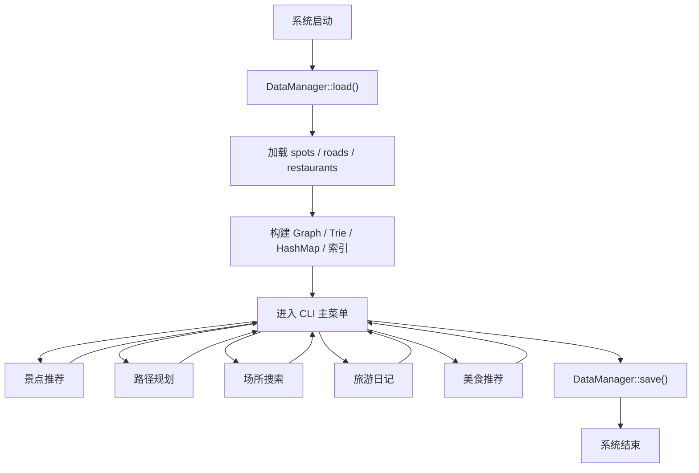

# PersonalizationTripSystem
个性化旅游系统（数据结构课程设计）
# 个性化旅游系统 TripSystem

一个面向景区、校园、园区等封闭区域的个性化旅游系统课程设计项目。  
当前仓库已经完全统一为纯 C++ 版本，核心能力围绕手写数据结构、算法实现和文件持久化展开。

## 项目定位

本项目不以数据库驱动的常规业务系统为目标，而是重点展示以下能力：

- 手写 `HashMap`、`MinHeap`、`Trie`、图结构等核心数据结构
- 基于 Top-K、最短路径、KMP、Huffman 等算法完成推荐、搜索、路径规划和压缩
- 使用 JSON 和二进制文件完成数据持久化
- 通过 CLI 交互形成完整、可答辩的演示闭环

## 当前状态

截至 2026 年 4 月 12 日：

- Java 版本已彻底移除
- 仓库只保留 C++ 主工程
- C++ 主程序已经可以编译、启动并完成部分核心功能演示

## 已实现能力

| 模块 | 当前状态 | 说明 |
|------|----------|------|
| CLI 主菜单 | 已完成 | 可进入推荐、路径、搜索、美食、日记占位模块 |
| DataManager | 已完成 | 启动加载、退出保存、示例数据自动生成 |
| HashMap | 已完成 | 用于索引、查找和去重 |
| MinHeap | 已完成 | 用于 Top-K 和后续 Huffman |
| Trie | 已完成 | 用于前缀补全 |
| 路径规划 | 已完成第一版 | 已支持单目标最短路径 |
| 景点推荐 | 已完成第一版 | 已支持 Top-K 推荐 |
| 场所搜索 | 已完成第一版 | 已支持补全和匹配 |
| 美食推荐 | 已完成第一版 | 已支持按景点推荐附近餐厅 |
| 旅游日记 | 进行中 | 当前已预留入口，后续补 Huffman 压缩 |

## 系统流程



## 快速开始

### 环境要求

- Windows PowerShell
- `g++` 可用

当前仓库里已经提供 PowerShell 构建脚本，因此不依赖 `cmake` 也能直接编译。

### 构建

```powershell
powershell -ExecutionPolicy Bypass -File .\cpp\scripts\build.ps1
```

### 运行

```powershell
.\cpp\build\tripsystem.exe .\cpp\data
```

首次运行如果发现 `cpp/data/` 下没有数据文件，程序会自动生成一份演示数据集。

## 目录结构

```text
.
├── cpp/
│   ├── include/
│   │   └── tripsystem/
│   │       ├── app/
│   │       ├── core/
│   │       └── models/
│   ├── src/
│   │   ├── app/
│   │   ├── core/
│   │   └── main.cpp
│   ├── data/
│   ├── scripts/
│   └── README.md
├── docs/
│   ├── consensus/
│   ├── 个性化旅游系统核心功能点(1).md
│   └── 软件开发文档.md
├── plans/
│   ├── cpp-approach.md
│   └── plan.md
└── reports/
```

## 核心数据文件

当前示例数据存放于 `cpp/data/`：

- `spots.json`
- `roads.json`
- `restaurants.json`

后续旅游日记模块将增加：

- `diaries/{id}.json`
- `diaries/{id}.bin`

## 文档入口

- 开发计划：[plans/plan.md](plans/plan.md)
- C++ 实施说明：[plans/cpp-approach.md](plans/cpp-approach.md)
- 软件开发文档：[docs/软件开发文档.md](docs/软件开发文档.md)
- 核心功能点：[docs/个性化旅游系统核心功能点(1).md](docs/个性化旅游系统核心功能点(1).md)
- C++ 工程说明：[cpp/README.md](cpp/README.md)
- 共识记录目录：[docs/consensus/README.md](docs/consensus/README.md)

## 下一阶段计划

- 完成旅游日记模块
- 接入 Huffman 压缩与解压
- 补充更完整的 JSON 数据导入与校验
- 增加多目标路径规划
- 增加测试和性能统计

## 仓库说明

当前仓库的唯一实现版本为 C++。  
后续所有开发、测试、文档和答辩材料都以 `cpp/` 子工程为唯一依据。
