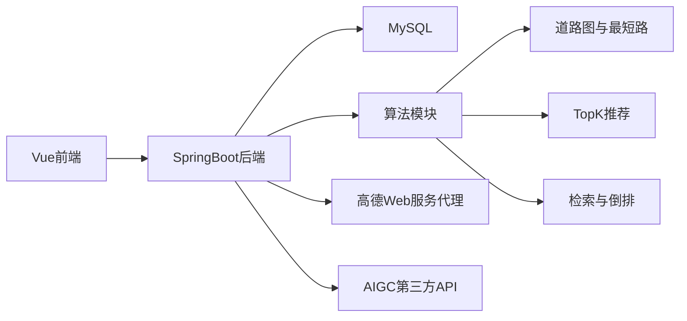

# 个性化旅游系统（Web 前后端分离）实施方案

> 课程约束更新：**核心功能不要使用数据库完成**。
>
> 本项目的落实方式（已开始落地）：
>
> - 核心算法（推荐 TopK、最短路、多目标路线、附近设施、模糊查找、倒排索引、压缩等）全部基于 **自建内存数据结构**，数据来源为 **JSON 导入**，并可序列化回文件。
> - 后端默认运行于 `nodb`（无 DB 依赖）模式；数据库相关仅允许作为“可选对比/扩展”，且不影响核心功能演示。

## 1. 技术选型（按课程约束更新）

- 后端：Java Spring Boot（默认 `nodb` 运行，不依赖数据库）
- 前端：Vue
- 地图：高德地图（允许联网演示）
- 数据承载：JSON 导入 + 内存数据结构（可序列化回文件），**核心功能不使用数据库**
- 检索：自建倒排索引（核心），可选用 MySQL FULLTEXT/LIKE 仅做“对比实验”（不参与核心功能验收）
- AIGC：允许第三方在线 API，后端封装异步任务

> 备注：题目里提到“最好使用 C++”。本项目可采用 **C++ 实现核心算法模块**（排序/TopK、最短路、倒排索引、压缩等），通过“独立算法服务/库”与 Spring Boot 集成；见 [`plans/cpp-approach.md`](plans/cpp-approach.md:1)。

> 说明：高德地图的可视化与路径展示可分两层：
>
> 1. 前端地图展示与绘制（AMap JS SDK）
> 2. 后端提供算法路径（道路图最短路）与（可选）高德 Web 服务对照路线

## 2. 验收演示脚本与页面清单（每项 1 个入口）

- 目的地推荐：景点/学校 Top10（热度、评分、兴趣加权，支持动态变化）
- 目的地查询：按名称/类别/关键词查询 + 结果排序
- 进入景区或校园：显示内部道路图 + 当前位置选择
- 路线规划：
  - 单目标：最短距离、最短时间、交通工具约束/混合
  - 多目标：选择多个点，输出从当前位置出发参观并返回的路线
  - 室内：楼层切换与门-电梯-房间导航
- 场所查询：附近设施（按道路网络距离排序，支持类别过滤）
- 旅游日记：撰写/上传媒体、统一管理、浏览量热度、评分
- 日记交流：目的地相关排序、标题精确查找、内容全文检索、压缩存储
- 美食推荐：Top10（热度、评分、距离），菜系过滤，模糊查找
- AIGC：提交生成任务 -> 轮询状态 -> 展示结果（视频或动图）

## 3. 领域模型与数据设计（核心实体）

### 3.1 基础数据

- Destination：景区/校园（>=200）
- PoiNode：内部节点（景点、教学楼、宿舍楼、办公楼、房间、入口、电梯等）
- Edge：道路边（>=200 条/目的地），包含距离、理想速度、拥挤度、可通行交通工具集合、是否电瓶车固定线等
- Facility：服务设施（>=10 类，>=50 个/目的地）
- Food：美食/窗口/店铺（可视作 Facility 的子类或独立表）

### 3.2 用户与偏好

- User：系统用户（>=10）
- UserPreference：类别偏好、关键词偏好、历史点击/收藏

### 3.3 日记与互动

- Diary：文本 + 媒体引用
- DiaryView：浏览记录（用于热度）
- DiaryRating：评分

### 3.4 检索相关

- MySQL FULLTEXT：对 Diary 内容列建立全文索引（快速上线）
- 自建倒排索引：term -> postingList（docId, tf, positions 可选）

## 4. 核心算法落点（满足题目“自己设计数据结构并编程实现”）

### 4.1 推荐与 Top10（不完全排序 + 动态变化）

目标：用户通常只看前 10，要求无需完全排序，且数据动态变化（热度/评分/偏好）。

推荐打分示例（可配置）：

- score = a*normalize(heat) + b*normalize(rating) + c*interestMatch + d*normalize(distance)（美食/设施场景）

Top10 计算策略（两层）：

1. 线上查询时：使用 TopK（小顶堆大小 K=10）扫描候选集，复杂度 O(N log K)，避免全排序 O(N log N)
2. 动态更新时：维护每个目的地的候选集“近似实时 Top10”缓存
   - 方案 A：Indexed Min-Heap/TreeSet 维护 Top10 + 其余候补（更新单条数据时 O(log N)）
   - 方案 B：定时重算 + 增量修正（适合大量变化）

实现要求：

- TopK：必须是自己实现的堆/选择算法（如 quickselect 取第 K 大 + 局部排序），而非直接调用库排序
- 动态变化：热度（浏览、点击）、评分（用户打分）、拥挤度（道路边）都能触发增量更新或缓存失效

### 4.2 查询（查找 + 排序）

- 精确查找：HashMap/字典索引（name -> id）或数据库唯一索引
- 模糊查找：
  - n-gram 倒排（如 2-gram/3-gram）
  - 或 Trie 前缀（适合名称前缀）
- 结果排序：同样用 TopK/堆取前 10，或对小结果集全排序

### 4.3 路线规划（最短路径 + 多点）

#### 单目标

- 最短距离：Dijkstra（边权=距离）
- 最短时间：Dijkstra（边权=距离 / (拥挤度\*理想速度)）
- 交通工具约束：
  - 边可通行工具集合过滤
  - 混合工具：状态扩展 Dijkstra，将状态定义为 node + currentTool，边权取对应工具速度；允许在节点换乘（加换乘代价）

#### 多目标（途经多点并返回）

- 小规模（例如 <=12 个目标点）：位掩码 DP + 预计算两两最短路
- 大规模：贪心插入 + 2-opt 局部优化（可演示即可）

### 4.4 场所查询（附近设施，不能用直线距离）

- 以道路网络最短路距离为准：从选中节点出发跑 Dijkstra
- 只需要附近一定范围：可在 Dijkstra 过程中当最小堆顶距离超过 R 时停止
- 对设施按距离排序：TopK 或全排序（设施量小则全排序）

### 4.5 室内导航

- 楼层子图 + 垂直连接（电梯/楼梯）
- 室内的门到电梯、楼层间、楼层内到房间均可统一为最短路

### 4.6 日记检索与压缩

- 快速上线：MySQL FULLTEXT/LIKE
- 对比实现：自建倒排索引（内存构建 + 可落库）
- 无损压缩：对 Diary 文本/媒体元数据做压缩存储（如 Huffman/LZ 系列任选其一，必须自己实现核心逻辑）

## 5. 后端接口分层与模块

建议模块：

- graph：道路图、导入、最短路、近邻设施
- recommend：TopK、打分、缓存
- search：精确/模糊/全文检索（MySQL + 自建倒排）
- diary：日记、浏览、评分、压缩
- aIGC：任务、状态、结果
- mapProxy：高德 Web 服务代理

## 6. Mermaid 总体架构图

## 7. 关于高德 Key 不暴露的现实约束与建议

- AMap JS SDK 在浏览器加载时通常需要 JS Key，浏览器侧可见，严格意义上无法做到完全不暴露。
- 可行折中：
  1. JS Key 仅用于地图渲染，做 Referer/域名白名单限制，风险可控
  2. 真正敏感的 Web 服务 Key 放后端，通过代理接口调用，不给前端

## 8. 里程碑推进顺序（与 Todo 对齐）

- 先工程骨架 + 数据导入 + 图算法（路线规划、附近设施）跑通
- 再推荐/查询/检索
- 再日记与美食
- 最后室内与 AIGC 补齐演示
